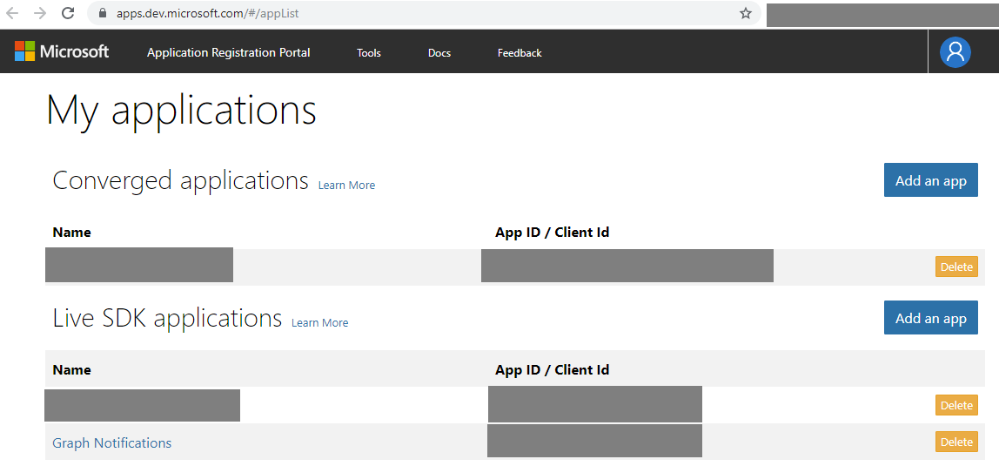
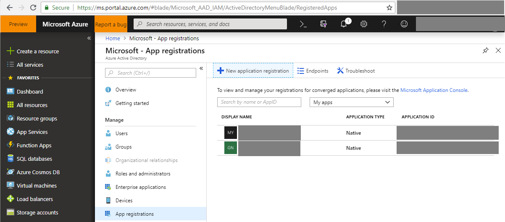
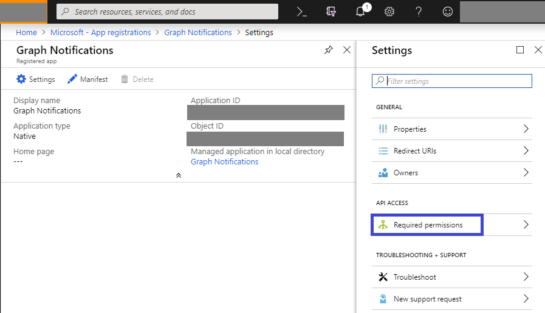
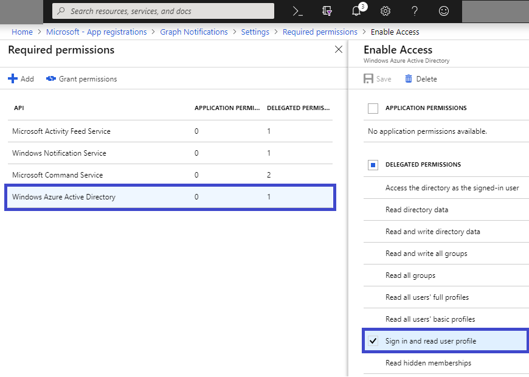
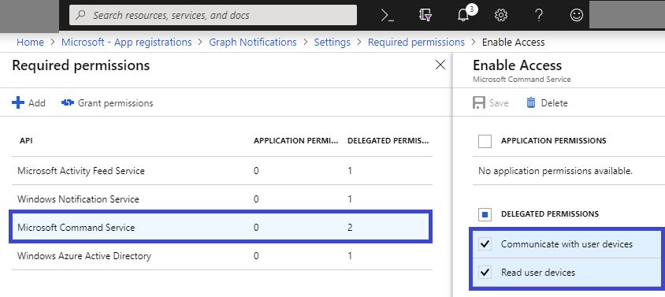
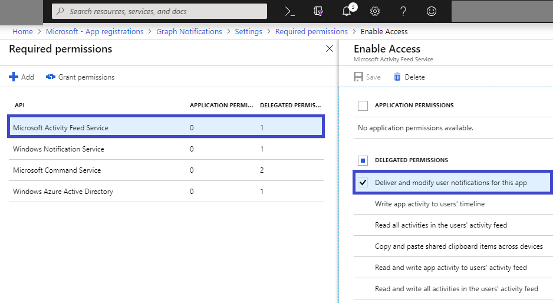
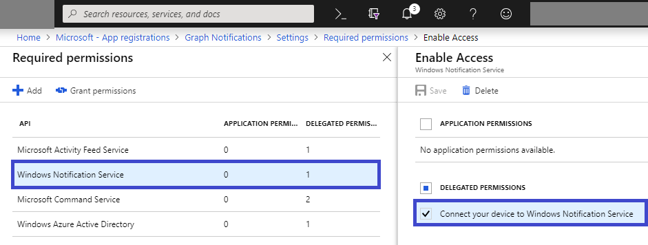

### MSA and AAD Authentication Registration

Microsoft Account (MSA) or Azure Active Directory (AAD) authentication registration is required for all features of the SDK including Notifications, except for the Nearby sharing APIs. 

If you do not already have an MSA and wish to use one, register on [account.microsoft.com](https://account.microsoft.com/account).

Next, if you are using MSA as the authentication and identity framework for your users, you must register your app with Microsoft by following the instructions on the [Application Registration Portal](https://apps.dev.microsoft.com/) (if you do not have a Microsoft developer account, you must create one first). You should receive a client ID string for your app; make sure to remember the location or save this. Later this will be used during Graph Notifications onboarding. 
Note that an app using MSA authentication needs to be registered as a Live SDK application as shown below.

If you're writing an app that uses AAD as work account or school account authentication and identity framework, you must register your app via [Azure Active Directory Authentication Libraries](https://docs.microsoft.com/azure/active-directory/develop/active-directory-authentication-libraries) in order to get the client ID, as shown below. 
 
When creating a new app registration, there are a few permissions required in order to use Graph Notifications and other connected device platform capabilities. Please see below. 

* Add user sign-in permission shown as below.

* Add Command Service permissions for device information, shown as below.

* Add Graph Notifications permission under Activity Feed Service APIs, shown as below.

* At the end, if you are writing cross-platform application including an UWP app running on Windows, make sure to add Windows Notification Service permission, shown as below. 

