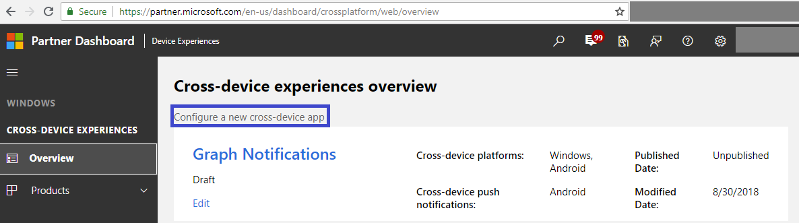

### Register your app for push notifications

Register your application with Google for [Firebase Cloud Messaging](https://firebase.google.com/docs/cloud-messaging/android/client) support. Be sure to make note of the sender ID and server key that you receive; you'll need them later.

Once registered, you must associate push notification functionality with the Connected Devices Platform in your app.

```Java
mNotificationRegistration = new ConnectedDevicesNotificationRegistration();
mNotificationRegistration.setType(ConnectedDevicesNotificationType.FCM);
mNotificationRegistration.setToken(token);
mNotificationRegistration.setAppId(Secrets.FCM_SENDER_ID);
mNotificationRegistration.setAppDisplayName("SampleApp");
```

### Register your app in Microsoft Windows Dev Center for cross-device experiences

> [!IMPORTANT]
> This step is only required if you want to use Project Rome features to access data from or make requests of non-Windows devices. If you only target Windows devices, you do not need to complete this step.

Go to Dev Center Dashboard, navigate to Cross-Device Experiences from the left side navigation pane, and select configuring a new cross-device app, shown as below.


The Dev Center on-boarding process requires the following steps:
* Select supported platforms – select the platforms where your app will have a presence and be enabled for cross-device experiences. In the case of Graph Notifications integration, you can select from Windows, Android, and/or iOS.


* Provide app IDs – provide app IDs for each of the platform where your app has a presence. For Android apps, this is the Package Name you assigned to your app when you created the project. The Package Name can be found in your Firebase console under Project Overview -> General. You may add different IDs (up to ten) per platform – this is in case you have multiple version of the same app, or even different apps, that want to be able to receive the same notifications sent by your app server targeted at the same user. 


* Provide or select the app IDs from MSA and/or AAD app registrations. These client IDs corresponding to MSA or AAD app registration were obtained in the previous MSA/AAD app registration steps from above. 


* Graph Notifications and other Connected Devices Platform capabilities leverage each of the native notification platforms on major platforms to send notifications down to the app client endpoints, namely, WNS (for Windows UWP), FCM (for Android) and APNS (for iOS). Provide your credentials for these notification platforms to enable Graph Notifications to deliver the notifications for your app server, when you publish user-targeted notifications. For Android, [enabling the Cloud Messaging service](https://firebase.google.com/docs/cloud-messaging/android/client) is a prerequisite to using Microsoft Graph Notifications. Also, note that the required Sender ID corresponds to the Firebase Cloud Messaging Sender ID, and the API key corresponds to the Legacy Server Key. Both can be found in Firebase Console -> Project -> Settings, under the Cloud Messaging tab, as shown in the screenshot.


* The last step is to verify your cross-device app domain, which serves as a verification process to prove that your app has the ownership of this domain which acts like a cross-device app identity for the app you registered.

