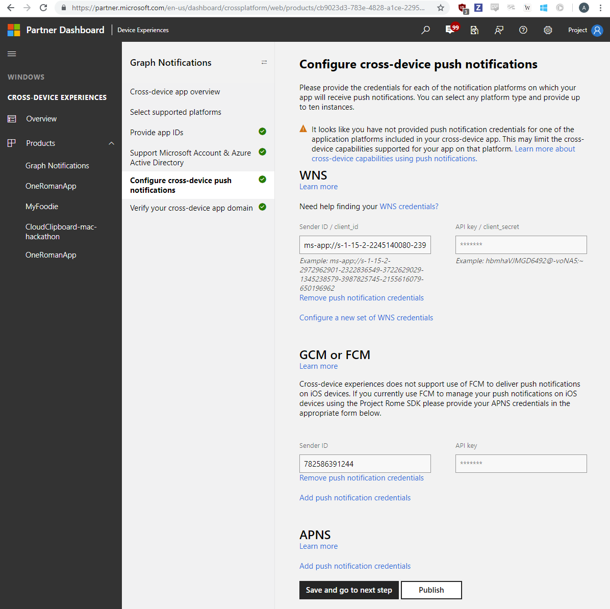

### Register your app for push notifications

Register your application with Apple for [Apple Push Notification](https://developer.apple.com/notifications/) support. Be sure to make note of the sender ID and server key that you receive as you'll need them later.

Once registered, you must associate push notification functionality with the Connected Devices Platform in your app.

```ObjectiveC
self.notificationRegistration = [[MCDConnectedDevicesNotificationRegistration alloc] init];
    if ([[UIApplication sharedApplication] isRegisteredForRemoteNotifications])
    {
        self.notificationRegistration.type = MCDNotificationTypeAPN;
    }
    else
    {
        self.notificationRegistration.type = MCDNotificationTypePolling;
    }
    self.notificationRegistration.appId = [[NSBundle mainBundle] bundleIdentifier];
    self.notificationRegistration.appDisplayName = (NSString*)[[NSBundle mainBundle] objectForInfoDictionaryKey:@"CFBundleDisplayName"];
    self.notificationRegistration.token = deviceToken;
    self.isRegisteredWithToken = YES;
```

### Register your app in Microsoft Windows Dev Center for cross-device experiences

> [!IMPORTANT]
> This step is only required if you want to use Project Rome features to access data from or make requests of non-Windows devices. If you only target Windows devices, you do not need to complete this step.

Register your app for the [cross-device experiences feature of the Microsoft Developer Dashboard](https://developer.microsoft.com/dashboard/crossplatform/web). This is a different procedure from MSA and AAD app registration above. The main goal for this process is to map the platform specific app identities with a cross-platform app identity that is recognized by Connected Devices Platform. This step will also enable sending notifications using the native push notification services corresponding to the mobile platform(s) your app utilizes. For iOS, it enables notifications to be sent to iOS app endpoints via APNS – Apple Push Notification Service.

Go to Dev Center Dashboard, navigate to Cross-Device Experiences from the left side navigation pane, and select configuring a new cross-device app.


The Dev Center on-boarding process require the following steps:

* Select supported platforms – select the platforms where your app will have a presence and be enabled for cross-device experiences. In the case of Graph Notifications integration, you can select from Windows, Android, and/or iOS, depending on what platforms you are using. 

* Provide app IDs – provide app IDs for each platform you are using. For iOS apps, this is the package name you assigned to your app when you created the project. Note that you may add different IDs (up to ten) per platform – this is in case you have multiple version of the same app, or even different apps, that want to be able to receive the same notifications sent by your app server targeted at the same user. 

* Provide or select the app IDs from MSA and/or AAD app registrations obtained in the previous MSA/AAD app registration steps above. 

* Provide your credentials for the native notification platforms relevant to your app (i.e. WNS for Windows, FCM for Android, and/or APNS for iOS) to enable delivery of notifications from your app server when you publish user-targeted notifications. 

* Finally, verify your cross-device app domain to make sure your app has the ownership of the domain and can use it as a cross-device identity for your app. 