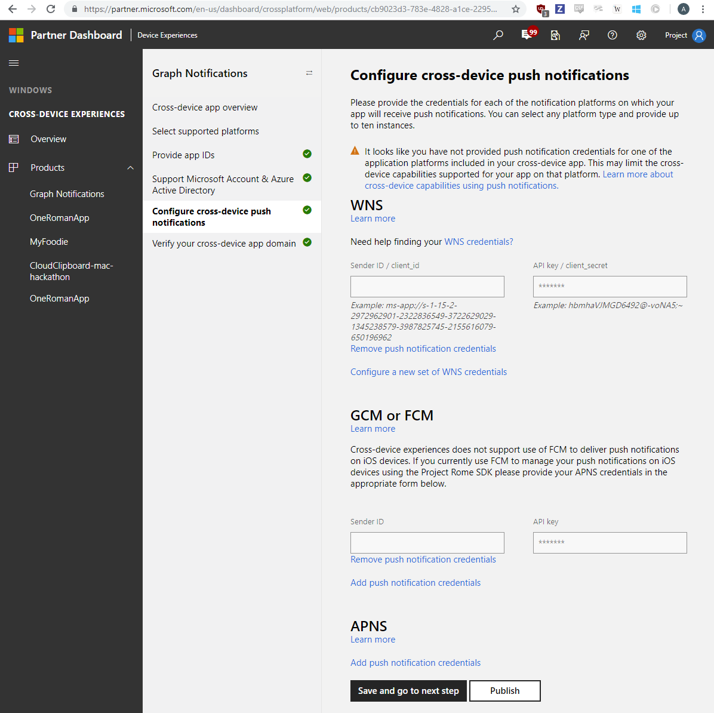

### Register your app in Microsoft Windows Dev Center for cross-device experiences
Next, you need to register your app for the [cross-device experiences feature of the Microsoft Developer Dashboard](https://developer.microsoft.com/dashboard/crossplatform/web). This is a different procedure from MSA and AAD app registration, which was covered in the steps above. The main goal for this process is to map the platform specific app identities with a cross-platform app identity that is recognized by Connected Devices Platform, and at the same time authorizes Microsoft Graph Notifications to send notifications using the native push notification services corresponding to each OS platform. In this case, it enables Graph Notifications to send notifications to Windows UWP app endpoints via WNS – Windows Notification Service. 
Go to Dev Center Dashboard, navigate to Cross-Device Experiences from the left side navigation pane, and select configuring a new cross-device app, shown as below.

The Dev Center on-boarding process require the following steps:
* Select supported platforms – select the platforms where your app will have a presence and be enabled for cross-device experiences. In the case of Graph Notifications integration, you can select from Windows, Android, and/or iOS. Shown as below.

* Provide app IDs – provide app IDs for each of the platform where your app has a presence. Shown as below.

> [!NOTE]
> You may add different IDs (up to ten) per platform – this is in case you have multiple version of the same app, or even different apps, that want to be able to receive the same notifications sent by your app server targeted at the same user. 

* Provide or select the app IDs from MSA and/or AAD app registrations. These client IDs corresponding to MSA or AAD app registration were obtained in the previous MSA/AAD app registration steps from above. Shown as below. 

* Graph Notifications and other Connected Devices Platform capabilities leverages each of the native notification platforms on major platforms to send notifications down to the app client endpoints, namely, WNS (for Windows UWP), GCM (for Android) and APNS (for iOS). Provide your credentials for these notification platforms to enable Graph Notifications to deliver the notifications for your app server, when you publish user-targeted notifications. Shown as below. 

> [!NOTE] 
> For Windows UWP apps, enabling WNS push notification is a prerequisite to use Microsoft Graph Notifications. See [WNS Overview](https://docs.microsoft.com/windows/uwp/design/shell/tiles-and-notifications/windows-push-notification-services--wns--overview) for more details. Once you complete the onboarding, you can then provide the push credentials via Windows Dev Center to the Connected Device Platform. 
* The last step is to verify your cross-device app domain, which serves as a verification process to prove that your app has the ownership of this domain which acts like a cross-device app identity for the app you registered. Shown as below.  

Now you are all set with onboarding! Please proceed to next section. 

